**Програмна інженерія в системах управління. Лекції.** Автор і лектор: Олександр Пупена 

| [<- до лекцій](README.md) | [на основну сторінку курсу](../README.md) |
| ------------------------- | ----------------------------------------- |
|                           |                                           |

# Керування ідентифікацією і доступом

### Процедури керування ідентифікацією доступу 

Керування ідентифікацією та доступом(**Identity** **and** **Access** **Management**), **IAM** 

- IAM – політики і технології для забезпечення доступу людей та/або застосунків до певних ресурсів

- процедури
  - **Ідентифікація** – розпізнавання користувача (назвися!)
    - за іменем (username ), 
    - за адресою email, 
    - номер облікового запису і т.п.
  - **Автентифікація** – визначення того, що це дійсно він, а не хтось інший, наприклад за паролем (доведи що це ти!)
  - **Авторизація** – що можна йому робити, а що ні, наприклад за роллю (тобі можна тільки це!)
  - керування усіма процедурами 

#### Шари захисту

**вирішується на різних рівнях мережних протоколів**

- фізичний: захист середовища від прослуховування і підключення (напр. в трубах с газом, падіння тиску - тривога)
- канальний, мережний, транспортний: шифрування (конфіденційність), контрольні суми/хеші (цілісність), екрани (аналіз трафіку на підозрілі пакети)
- прикладний: автентифікація, електронний підпис  

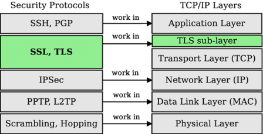


#### Учасники обміну

•служби(сервіси)/застосунки: наприклад Node-RED, хмарні застосунки

•користувачі(люди)

як правило використовуються різні способи для застосунків та користувачів

#### Типи автентифікації  

•користувач/пароль (для людей): 

•вбудовані в Http, basic та інші -> норм при шифруванні

•через форму (POST, PUT, PATCH) -> найбільш безпечний

•через параметри запиту -> не рекомендуються

•двофакторна автентифікація (для людей)

•сертифікати (для застосунків)

•API key (для застосунків)

•маркери (для застосунків): OAuth и OpenID …

### Автентифікація: користувач + пароль

#### HTTP-автентифікація

- ім'я користувача/пошта + пароль
- зберігається на сервері
- послідовність для Basic HTTP:
  - перше підключення - сервер повертає "401 Unauthorized» + заголовок "WWW-Authenticate" 
  - браузер реагує формою вводу ім'я/пароль 
  - браузер відправляє усі запити с заголовком "[Authorization](https://developer.mozilla.org/ru/docs/Web/HTTP/Заголовки/Authorization)”, в якому передається ім'я користувача і пароль:
    - в кодуванні base64 (Basic), не рекомендується без HTTPS
    - шифрування (Digest), не рекомендується без HTTPS
  - авторизація вирішується на стороні серверу (ролі або інших дани)

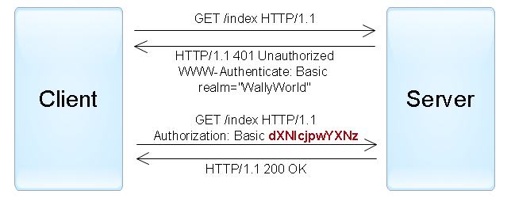

#### HTTP-Basic у вузлі HTTP Request

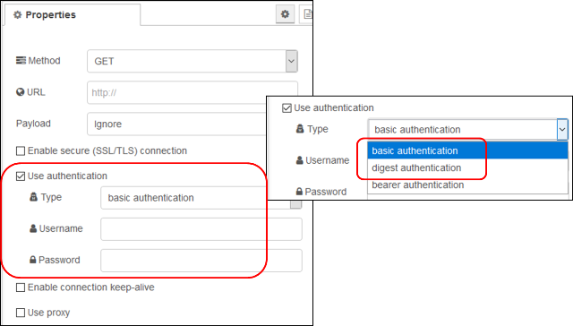

#### HTTP-Basic у серверній частині Node-RED

Використовується для:

- Admin console – доступ до редактору
- Nodes
- Static Pages

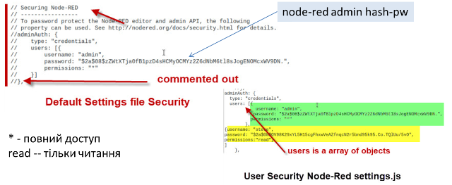

#### HTTP-Basic в HTTP-in, Dashboard

•httpNodeRoot (HTTP-in, Dashboard) – тільки один користувач

•httpStatic (статические страницы, usr/lib/node-modules/public )– тільки один користувач

•налаштовується в “Settings.js “

```json
httpNodeAuth: {user:"user",pass:"$2a$08$zZWtXTja0fB1pzD4sHCMyOCMYz2Z6dNbM6tl8sJogENOMcxWV9DN."},

```

```json
httpStaticAuth: {user:"fred",pass:"$2a$04$3gkGX/Q4VZ//F37kWvSU9eE9EM1WO2rdWk1oj/kfXIbeBON5eA56S"},
```

•http-in відобразить тільки коли користувач успішно зайшов

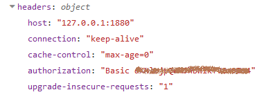

#### Автентифікація через форму

- немає певного стандарту -> реалізації специфічні

- послідовність:
  - запускається HTML-форма, 
  - користувач вводить ім'я, пароль 
  - відправляється на сервер через HTTP POST
  - якщо Ок, створюється маркер сесії (session token), 
  - як правило маркер розміщується в куки (cookies), при наступних запитах автоматично передається на сервер для авторизації

- не рекомендується без HTTPS

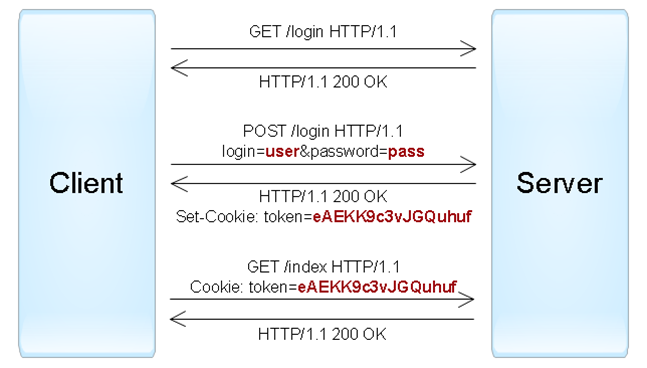

#### Користувач + пароль: проблеми

- логіни і паролі в різних системах користувачі вибирають однаковими
- записують і розповідають іншим
- коли система скомпрометована, ніхто навіть не дізнається про це
- прості паролі легко перебираються
- схильні до злому при невдалій реалізації серверу 

### Автентифікація по сертифікатам, TLS/SSL, HTTPs

#### TLS/SSL

- Протоколи безпечної передачі даних в Інтернет:
  - TLS –Transport Layer Security, протокол защиты транспортного уровня, TLS1.2/**TLS 1.3** (2018), RFC 8446
  - SSL –Secure Sockets Layer, рівень захищених сокетів (**застарів в 2015**)
  - «SSL» використовується як назва сімейства протоколів захисту і бібліотек, наприклад OpenSSL, LibreSSL
- для забезпечення безпечної передачі даних в загальнодоступній мережі
- використовується в:
  - **HTTPS** -Hypertext Transfer Protocol Secure, **порт 443**
  - SMTPS, POP3S, IMAPS – захищені протоколи електронної пошти

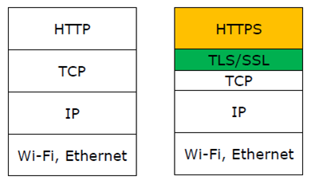

#### Безпека передачі даних

- **приватність** (privacy, захист від несанкціонованого доступу) – шляхом шифрування
- **цілісність** (integrity, захист від підробки даних) - хеш-функції
- **автентифікація** (authentication, захист від видачі за іншого) – цифровий підпис, інфраструктура відкритих ключів

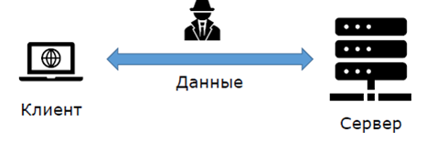

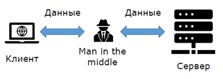

#### Шифрування

повідомлення -> **шифрування** –> незрозуміле повідомлення –> **дешифрування** –> повідомлення 

- симетричне (однаковий ключ) – швидка робота, важкість збереженості ключів
- асиметричне (різні):
- повільніше, але закритий (приватний) ключ тільки у володаря
- відкритий (публічний) ключ генерується на базі закритого
- комбінують: асиметричним передають ключ для симетричного


#### Цілісність і хеш-функції

- цілісність – наприклад через контрольну суму CRC, механізм хеш-функцій такий саме, але з більшими вимогами

**Хеш-функції** (hash function):

- перетворення масиву даних в рядок фіксованої довжини – хеш 
- за хешем не можна визначити, на основі яких даних він був створений
- колізія – одне і те ж значення хешу для різних вхідних даних
- різні криптографічні хеш функції (MD5 , SHA …) ті ж функції що і для шифрування
- зловмисник може замінити як дані так і хеш, якщо ключ йому відомий

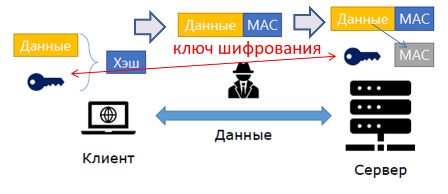

MAC - Message Authentication Code

#### Автентифікація і електронний (цифровий) підпис

- як визначити, що застосунок/людина дійсно той, за кого себе видає? при підключенні обмін повідомленнями може бути зі зловмисником
- електронний цифровий підпис:
  - засвідчує відправника
  - використовується для перевірки цілісності даних
- закритий ключ - > для шифрування, відкритий –> для розшифровування: якщо відкритим розшифровується, значить повідомлення прийшло від потрібного вузлу/застосунку 
- хто підтвердить, що відкритий ключ дійсно від того застосунку?

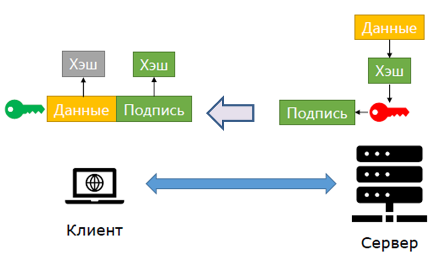

#### Сертифікати

- вузли в мережі не довіряють один одному, але довіряють центру сертифікації
- центр видає сертифікати – файли з різноманітною інформацією, в тому числі відкритим ключом серверу
- справжність сертифіката центр завіряє своїм підписом (одержувач має відкритий ключ центру і довіряє йому апріорі)
- коли вузол видає іншому вузлу сертифікат, той перевіряє його валідність
- сертифікати мать термін дії
- іноді сертифікати потрібно відправляти від клієнта до сервера


#### Інфраструктура відкритих ключів (KPI)

- ланцюжок центрів
- кореневі – видають сертифікати центру сертифікації 

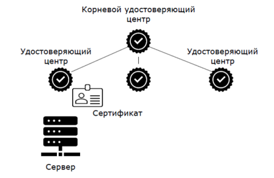

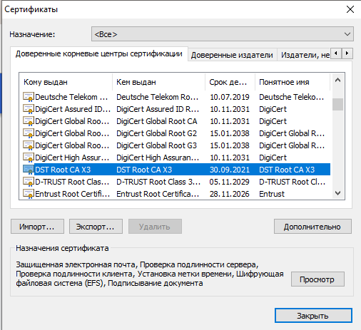

#### Само-підписаний сертифікат

- якщо вузли довіряють сертифікатам його можна включити в дозволені 

- кореневі - само-підписані сертифікати, вони за замовченням вже знаходяться в сховищах на ОС

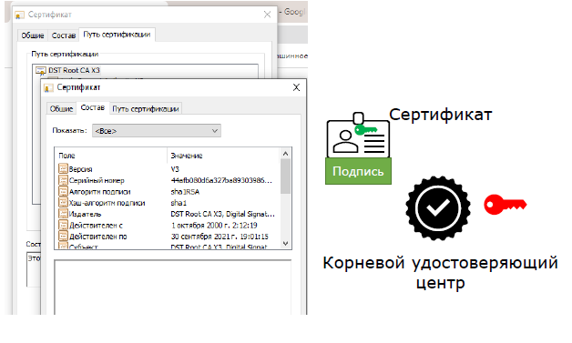

#### Установка з'єднання TLS1.2

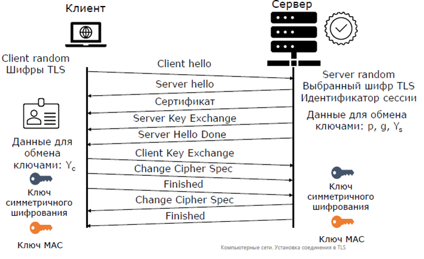

#### З'єднання TLS1.2

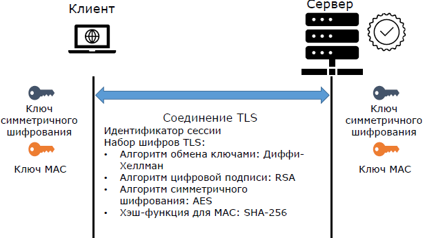

#### Файли сертифікату

.pem, .crt, .cer - готовий, підписаний центром сертифікації сертифікат.key - закритий або відкритий ключ;

.csr - запит на підпис сертифікату, в цьому файлі зберігається відкритий ключ плюс інформація про компанію і домен, який вказали

#### Створення серифікату: OpenSSL

- завантажити і встановити [OpenSSL](https://slproweb.com/products/Win32OpenSSL.html) (мін.версію)
- запустити 
- ввести команду для створення і само-підписання сертифікату 

```bash
req -newkey rsa:2048 -nodes -keyout c:/temp/domain.key -x509 -days 365 -out c:/temp/domain.crt
```

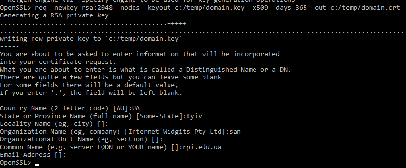

### HTTPs в Node-RED

#### Активація HTTPS в Node-RED

**settings.js**


#### Https/wss-клієнти в Node-RED

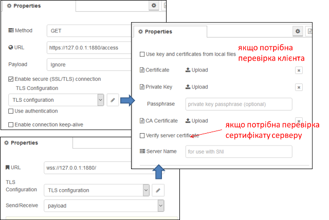

#### Http-request в Node-RED : підключення до серверу з самопідписаним сертифікатом

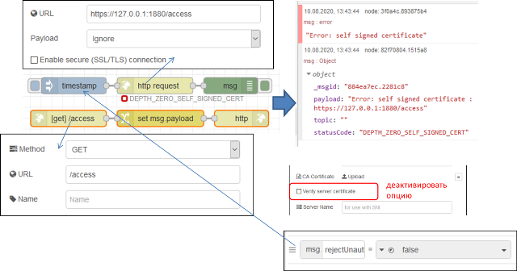

- виставити властивість «rejectUnauthorized=false» - дозволяє
- або в налаштуваннях конфігурації TLS прибрати Veriy server sertificate 

#### Web-socket клієнт в Node-RED: підключення до серверу з само-підписаним сертифікатом

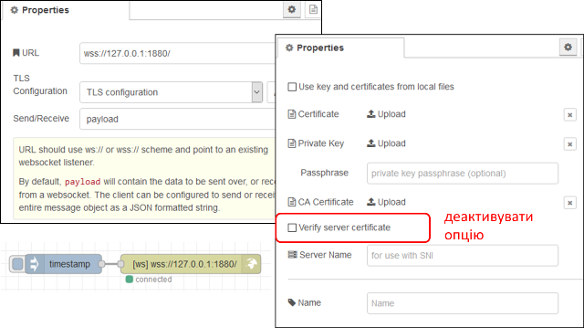

#### Додаткове налаштування Web-socket

**settings.js**

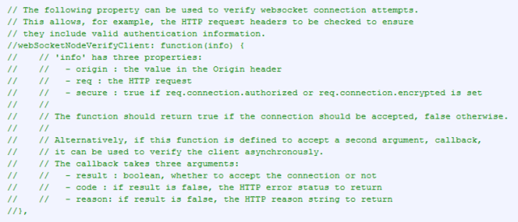

### Інші види автентифікації

#### Двофакторна автентифікація

- одноразові паролі
- генеруються на основі двофакторної авторизації:
  - що користувач знає: ім'я і пароль
  - чим володіє: телефон, генератор паролів

#### API-key

- API-key: довгі символьні послідовності
- використовуються для обміну між додатками
- генеруються автоматично, важко підібрати
- користувач не показує своє ім'я та пароль застосунку 
- користувач може анулювати ключ

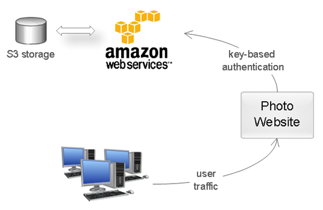


- реалізується через тіло або заголовки 


#### Token

- провайдер сервісів дає доступ до своїх сервісів через API
- провайдер сервісів (**service provider**) делегує функцію аутентифікації провайдеру аутентифікації (**authentication service**)
- прикладом провайдеру аутентифікації є соц.мережі, наприклад Facebook. Linkedin
- послідовність:
  - клієнтська програма автентіфікується на провайдері аутентифікації (наприклад по паролю)
  - отримує від нього маркер (**token**) для конкретного провайдера сервісів: містить інформацію про генератора, одержувача, термін дії ...
  - використовує цей маркер для зв'язку з провайдером сервісів
- стандарти: OAuth, OpenID Connect, SAML, і WS-Federation.

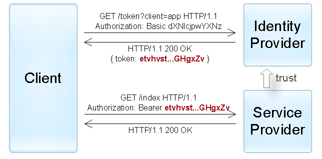

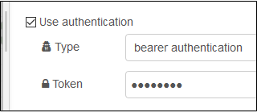

#### API-key (Google)

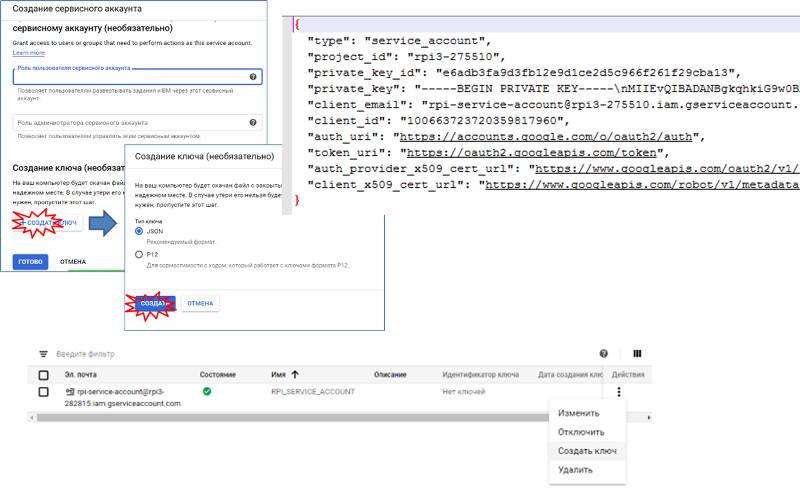


- [Обзор способов и протоколов аутентификации в веб-приложениях](https://habr.com/ru/company/dataart/blog/262817/)

| [<- до лекцій](README.md) | [на основну сторінку курсу](../README.md) |
| ------------------------- | ----------------------------------------- |
|                           |                                           |